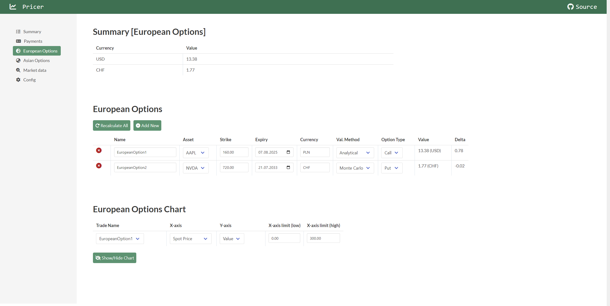
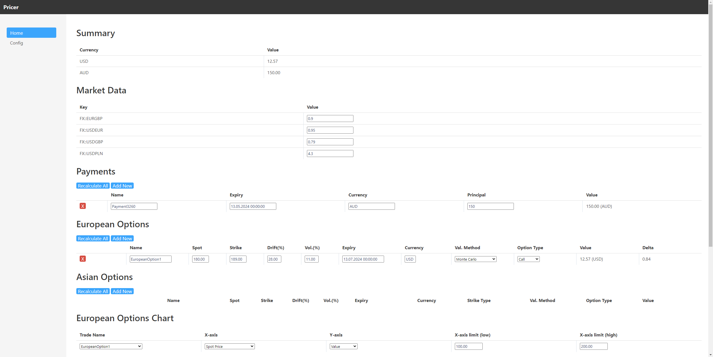
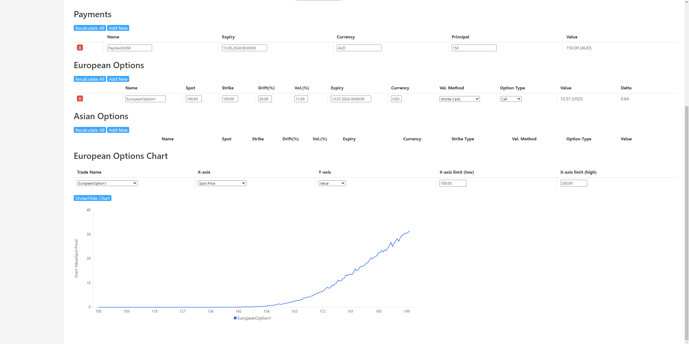

# Pricer
> [!NOTE]  
> * `theoretical_assignments/` : a folder that contains two reports about stock process modeling and option pricing.  
> * `demo_new/`, `demo_old/` : folders containing screenshots of the pricer web app after and before refactorization respectively.  
> * rest : pricer web application.

## Installation
1. Navigate to your local directory where the Pricer should be placed.
2. Clone the repository using commad: `git clone`.
3. Be sure that .NET 7.0 SDK is installed on your machine.
4. Inside the *Pricer* directory run the following command: `dotnet run`.

## Dependencies
This project is based on the Microsoft .NET framework [versions 7.0.*].  
Be sure that you have installed a proper SDK on your machine.  
If not - you can download it from this website: <a href="(https://dotnet.microsoft.com/en-us/download/dotnet/7.0)" target="_blank">https://dotnet.microsoft.com/en-us/download/dotnet/7.0</a>.

## Demo (after refactoring)

## Demo (before refactoring)

## Details
This pricer is a web application dedicated to valuating financial products - especially derivatives like European or Asian Options. The Scaffold of the project was froked from: https://github.com/MaciekFlis/pricer, and then it was developed by myself.  
This web application uses an MVU (Elm Architecture) design pattern. Every change made by the user generates a proper message and after the dispatch model is updated accordingly.
