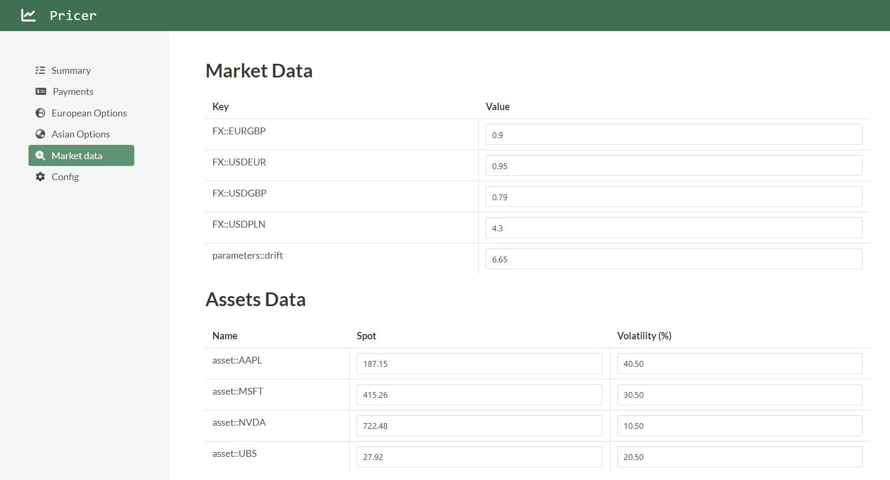
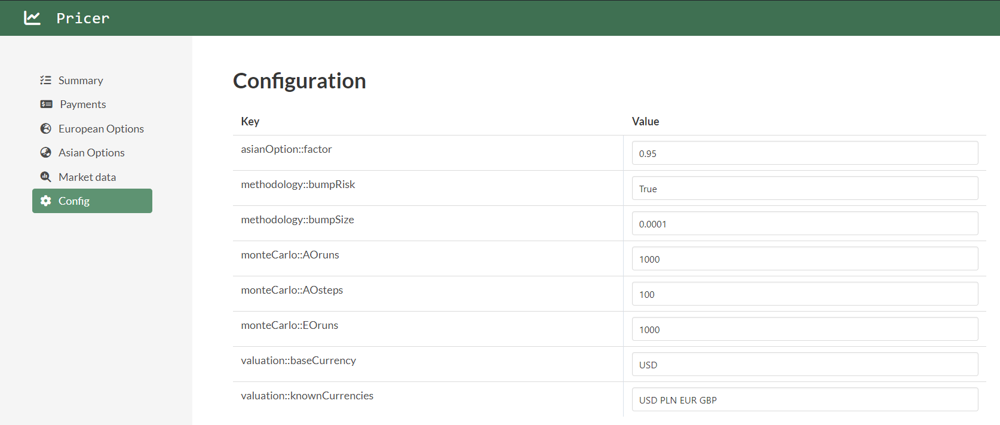

# Pricer
Pricer app - final assignment for the QSP.

## Installation
1. Navigate to your local directory where the Pricer should be placed.
2. Clone the repository using commad: `git clone`.
3. Be sure that .NET 7.0 SDK is installed on your machine.
4. Inside the *Pricer* directory run the following command: `dotnet run`.

## Dependencies
This project is based on the Microsoft .NET framework [versions 7.0.*].  
Be sure that you have installed a proper SDK on your machine.  
If not - you can download it from this website: <a href="(https://dotnet.microsoft.com/en-us/download/dotnet/7.0)" target="_blank">https://dotnet.microsoft.com/en-us/download/dotnet/7.0</a>.

## Demo (after refactoring)

    
    

    
    
    

## Demo (before refactoring)

